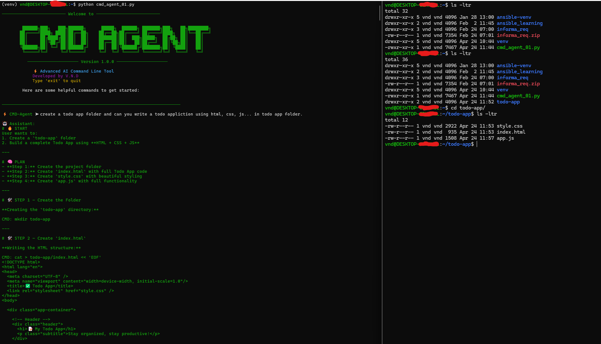
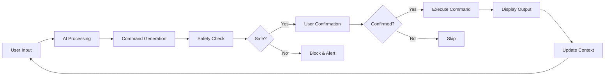

# 🤖 AI Command Assistant

[](LICENSE)
[](https://www.python.org/)
[](https://www.anthropic.com/)
[]()

> An intelligent command-line assistant powered by Claude Sonnet AI that understands natural language and executes OS-specific commands safely.



---

## 🌟 Overview

**AI Command Assistant** transforms the way you interact with your terminal. Instead of memorizing complex command syntax, simply describe what you want to do in natural language, and let AI translate it into the appropriate OS-specific command. With built-in safety features and a beautiful CLI interface, it's the perfect tool for developers, system administrators, and anyone who wants to boost their productivity.

### Why AI Command Assistant?

- 🧠 **Natural Language Processing**: Describe tasks in plain English
- 🛡️ **Safety First**: Automatic blocking of dangerous commands
- 🖥️ **Cross-Platform**: Seamlessly works on Windows and Linux
- ⚡ **Real-Time Execution**: Interactive command execution with user confirmation
- 🎨 **Beautiful Interface**: Colorful, intuitive CLI experience
- 🔄 **Context-Aware**: Maintains conversation history for intelligent responses

---

## ✨ Key Features

### 🤖 AI-Powered Intelligence
Leverages Claude Sonnet 4.6 to understand natural language queries and generate appropriate commands for your operating system.

### 🛡️ Built-in Safety Mechanisms
- Automatic detection and blocking of dangerous commands
- User confirmation required before execution
- Command sanitization and validation
- Comprehensive blocked commands list (format, rm -rf, shutdown, etc.)

### 🖥️ Cross-Platform Support
Automatically detects your operating system and generates platform-specific commands:
- **Windows**: `dir`, `ipconfig`, `tasklist`, etc.
- **Linux**: `ls`, `ifconfig`, `ps`, etc.

### ⚡ Interactive Execution
- Real-time command execution with output display
- Conversation history maintained for context
- Easy-to-use interface with colorful prompts
- Error handling and clear feedback

---

## 🚀 Getting Started

### Prerequisites

- Python 3.8 or higher
- API access to Claude Sonnet (IBM Services Essentials)
- pip (Python package manager)

### Installation

1. **Clone the repository**
   ```bash
   git clone https://github.com/vnd443/ai-command-assistant.git
   cd ai-command-assistant
   ```

2. **Install dependencies**
   ```bash
   pip install -r requirements.txt
   ```
   
   Required packages:
   - `openai>=1.0.0` - For AI integration
   - `python-dotenv>=1.0.0` - For environment management
   - `colorama>=0.4.6` - For terminal styling

3. **Configure environment variables**
   
   Create a `.env` file in the project root:
   ```env
   api_key=your_api_key_here
   base_url=https://servicesessentials.ibm.com/apis/v3
   model_id=global/anthropic.claude-sonnet-4-6
   ```
   
   ⚠️ **Important**: Never commit your `.env` file to version control!

4. **Run the assistant**
   ```bash
   python cmd_agent_01.py
   ```

---

## 💡 Usage Examples

### Starting the Assistant
```bash
python cmd_agent_01.py
```

You'll see a beautiful ASCII art header and the command prompt:
```
⚡ CMD-Agent ➤
```

### Example Interactions

**List files in current directory:**
```
⚡ CMD-Agent ➤ show me all files in this directory

🤖 Assistant: I'll list the files for you.
CMD: dir

⚙️ Detected Command: dir
Run command? (y/n): y

📄 Output:
[directory listing appears here]
```

**Check network configuration:**
```
⚡ CMD-Agent ➤ what's my IP address?

🤖 Assistant: I'll check your network configuration.
CMD: ipconfig

⚙️ Detected Command: ipconfig
Run command? (y/n): y

📄 Output:
[network details appear here]
```

**View running processes:**
```
⚡ CMD-Agent ➤ show me all running processes

🤖 Assistant: I'll display the running processes.
CMD: tasklist

⚙️ Detected Command: tasklist
Run command? (y/n): y

📄 Output:
[process list appears here]
```

**Exit the assistant:**
```
⚡ CMD-Agent ➤ exit
👋 Goodbye!
```

---

## 🏗️ Architecture



### Component Overview

1. **User Interface Layer**: Colorful CLI with Colorama styling
2. **AI Processing Layer**: Claude Sonnet integration via OpenAI SDK
3. **Safety Layer**: Command validation and dangerous command blocking
4. **Execution Layer**: Cross-platform command execution using subprocess
5. **Context Management**: Conversation history tracking for better AI responses

---

## 🔒 Safety Features

### Blocked Commands
The assistant automatically blocks dangerous commands including:
- `format` - Disk formatting
- `del /f` - Force delete
- `rd /s` - Recursive directory removal
- `shutdown` - System shutdown
- `diskpart` - Disk partitioning
- `mkfs` - File system creation
- `rm -rf /` - Recursive force removal
- `reboot` - System reboot

### Safety Workflow
1. AI generates command based on user input
2. Command is checked against blocked list
3. User confirmation is required before execution
4. Command executes with output capture
5. Errors are handled and reported clearly

### Customizing Safety Rules

You can modify the blocked commands list in `cmd_agent_01.py`:

```python
BLOCKED_COMMANDS = [
    "format", "del /f", "rd /s", "shutdown",
    "diskpart", "mkfs", "rm -rf /", "reboot"
]
```

---

## 🛠️ Technology Stack

| Component | Technology |
|-----------|-----------|
| **AI Model** | Claude Sonnet 4.6 (Anthropic) |
| **Language** | Python 3.8+ |
| **AI Integration** | OpenAI SDK |
| **CLI Styling** | Colorama |
| **Environment** | python-dotenv |
| **Execution** | subprocess |
| **Platform Detection** | platform module |

---

## 📁 Project Structure

```
ai-command-assistant/
├── cmd_agent_01.py          # Main application
├── cmd_agent_ss.png          # Screenshot
├── README.md                 # This file
├── .env                      # Environment variables (not in repo)
├── .env.example             # Environment template
├── .gitignore               # Git ignore rules
└── requirements.txt          # Python dependencies
```

---

## ⚙️ Configuration

### Environment Variables

The application requires these environment variables in your `.env` file:

```env
# API Configuration
api_key=your_api_key_here
base_url=https://servicesessentials.ibm.com/apis/v3
model_id=global/anthropic.claude-sonnet-4-6
```

### Getting API Access

1. Sign up for IBM Services Essentials
2. Navigate to API credentials section
3. Generate a new API key for Claude Sonnet
4. Copy the credentials to your `.env` file

---

## 🤝 Contributing

Contributions are welcome! Here's how you can help:

1. **Fork** the repository
2. **Create** a feature branch (`git checkout -b feature/AmazingFeature`)
3. **Commit** your changes (`git commit -m 'Add some AmazingFeature'`)
4. **Push** to the branch (`git push origin feature/AmazingFeature`)
5. **Open** a Pull Request

### Development Guidelines

- Follow PEP 8 style guide for Python code
- Add comments for complex logic
- Update documentation for new features
- Test on both Windows and Linux if possible
- Ensure safety features remain intact
- Never commit API keys or `.env` files

---

## 📝 Roadmap

### Version 1.1 (Planned)
- [ ] Command history and recall functionality
- [ ] Command suggestions based on context
- [ ] macOS support
- [ ] Custom command aliases
- [ ] Configuration file for user preferences

### Version 1.2 (Future)
- [ ] Web-based interface
- [ ] Command templates library
- [ ] Multi-language support
- [ ] Export command history to file
- [ ] Integration with popular shells (bash, zsh, powershell)

### Version 2.0 (Vision)
- [ ] Plugin system for extensibility
- [ ] Team collaboration features
- [ ] Advanced analytics and insights
- [ ] Cloud synchronization
- [ ] Voice command support

---

## 🐛 Troubleshooting

### Common Issues

**Issue**: `ModuleNotFoundError: No module named 'openai'`
- **Solution**: Run `pip install -r requirements.txt`

**Issue**: `KeyError: 'api_key'`
- **Solution**: Ensure `.env` file exists with correct API credentials

**Issue**: Commands not executing
- **Solution**: Check if command is in blocked list, verify OS compatibility

**Issue**: API connection errors
- **Solution**: Verify API key is valid and base_url is correct

---

## 📄 License

This project is licensed under the Apache License 2.0.

```
Copyright 2026 Venna Naga Durgaprasad

Licensed under the Apache License, Version 2.0 (the "License");
you may not use this file except in compliance with the License.
You may obtain a copy of the License at

    http://www.apache.org/licenses/LICENSE-2.0

Unless required by applicable law or agreed to in writing, software
distributed under the License is distributed on an "AS IS" BASIS,
WITHOUT WARRANTIES OR CONDITIONS OF ANY KIND, either express or implied.
See the License for the specific language governing permissions and
limitations under the License.
```

---

## 🙏 Acknowledgments

- **Anthropic** for Claude Sonnet AI technology
- **IBM Services Essentials** for API access
- **OpenAI** for the excellent SDK
- **Python Community** for amazing libraries
- All contributors and users of this project

---

## 📞 Contact & Support

- **Author**: Venna Naga Durgaprasad
- **GitHub**: [@vnd443](https://github.com/vnd443)
- **Repository**: [ai-command-assistant](https://github.com/vnd443/ai-command-assistant)
- **Issues**: [Report a bug](https://github.com/vnd443/ai-command-assistant/issues)

---

## ⭐ Show Your Support

If you find this project useful, please consider:
- ⭐ **Starring** the repository
- 🐛 **Reporting** bugs and issues
- 💡 **Suggesting** new features
- 📢 **Sharing** with your network
- 🤝 **Contributing** to the codebase

---

## 📊 Project Stats


---

<div align="center">

**Made with ❤️ by Venna Naga Durgaprasad**

**Empowering developers with AI-powered productivity tools**

[⬆ Back to Top](#-ai-command-assistant)

</div>